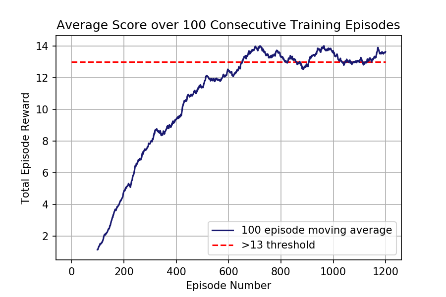

# Project: Navigation and Banana Collection. 
-----

## Description
For this project an agent was trained from scratch using a deep Q learning method to navigate around an open world environment while collect yellow bananas and avoiding blue bananas.
The following is an example of a trained agent in the environment.


## Problem Statement
### Environment and Rewards:
An open 3D space surrounded by four solid walls is created and randomly populated with blue and yellow bananas. An agent is then placed in the environment and given a reward of `+1` for collecting a yellow banana, and a reward of `-1` for collecting a blue banana. The goal of the agent is to collect as many yellow bananas as possible while avoiding blue bananas. The environment is episodic and runs for `1000` timesteps after which it is reset.
### State and Action Spaces:
The agent's observation of the underlying state space has `37` dimensions and contains the agent's velocity and ray-based perception of objects around the agent's forward direction. Given this information, the agent has to learn how to best select actions to maximise its total episodic reward. Four discrete actions are available to the agent at each timestep, corresponding to:

| Input  | Action        
| ------ | ------
| `0`    | move forward
| `1`    | move backward
| `2`    | turn left
| `3`    | turn right


### Solution:
The task is classed as solved when an agent can achieve an average score of `+13` over `100` consecutive episodes.

## Dependencies
To run this code you must run an environment with Python 3.6 kernel and the dependencies listed in `requirements.txt`. 

Running the following line will install the required dependencies:
```
pip install -r requirements.txt
``` 

Additionally you will need to download the Unity environment in which the agent was trained. Instruction for this can be found within the `DQN_navigation.ipynb` notebook or in [this link](https://github.com/udacity/deep-reinforcement-learning/tree/master/p1_navigation).

## Files
This repository contains the following files and folders: <br>
`Gifs` : A folder containing gifs of a trained agent in action. <br>
`Graphs` : A folder containing graphs used to evaluate a trained agent. <br>
`dqn_banana_agent.py` : A file containing the implementation of the deep Q learning algorithm. <br>
`DQN_navigation.ipynb` : A notebook to train, test and evaluate models. <br>
`Trained_agent_best.pth` : A saved model that has learnt to solve the environment. <br>

## Running
Please open and follow the instruction in the DQN_navigation.ipynb.

## Results
An agent was created that used a custom implementation of the deep Q learning algorithm, as described in ["Playing Atari with Deep Reinforcement Learning"](https://arxiv.org/pdf/1312.5602.pdf) by Mnih. et al, to solve a banana collection problem. A deep Q network (DQN) that could take in the current observed state and return the best action to take to maximise its reward was trained with the aid of an experience replay buffer and a soft target update. The architecture of this DQN is described in the following table:

| Layer |  Size  
|  ---- | ------
| Input (Observed State) |  37
| Hidden layer 1  | 64
| Hidden layer 2  | 32
| Hidden layer 3  | 16
| Output (Action) | 4

where each hidden layer is fully connected and followed by a ReLU activation function.

Using this architecture the agent was able to solve the problem after 653 episodes. This can be seen in the following graph. Additionally, this graph shows that the agent was able to constantly improve its score during training until the problem was solved.


Finally here are a some gifs of the final agent in action.


