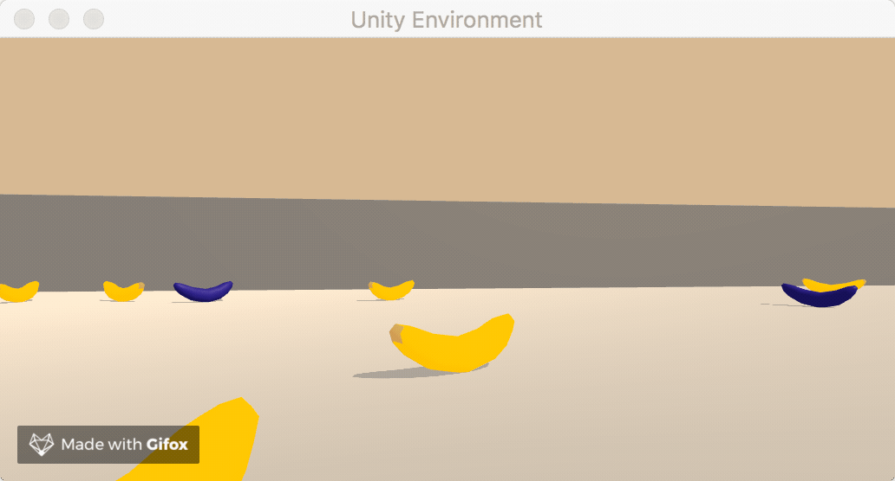
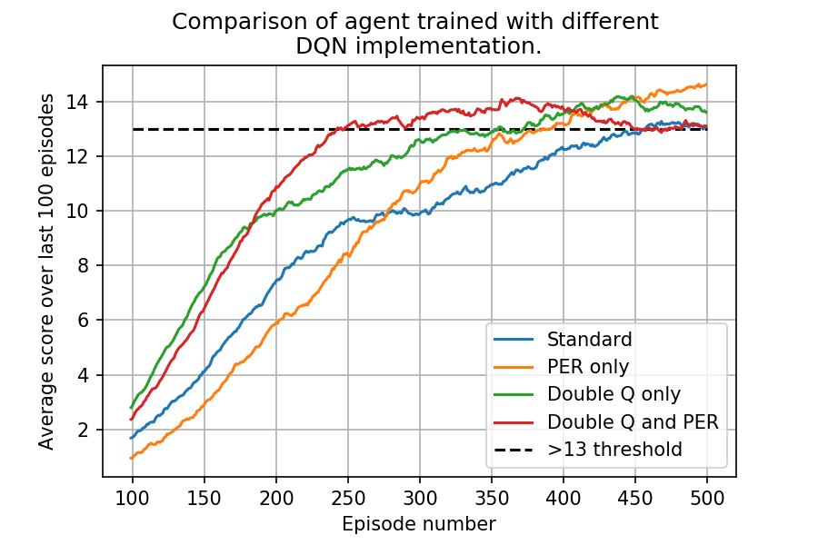
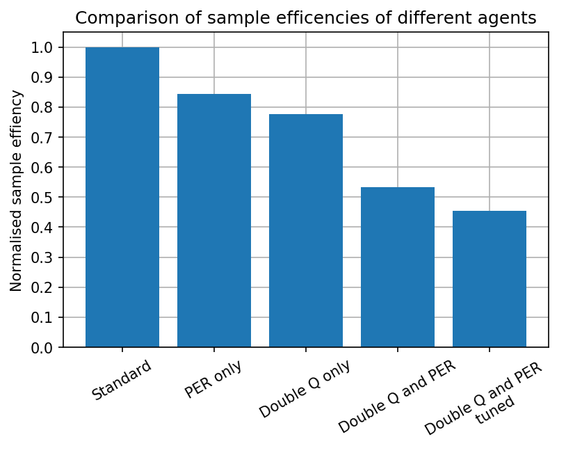
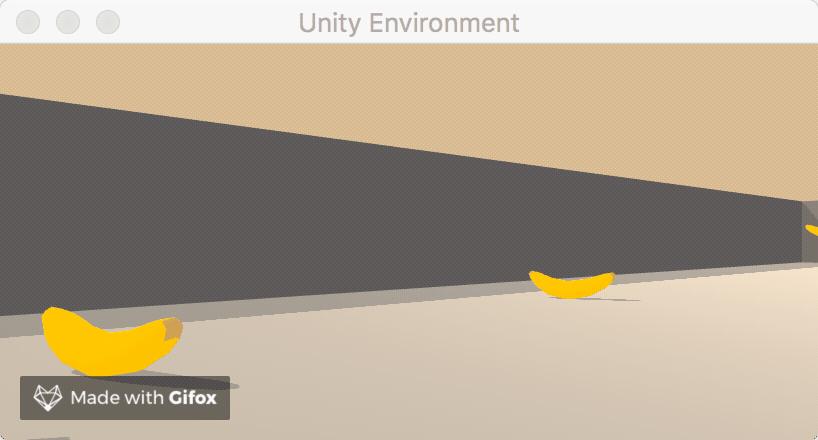
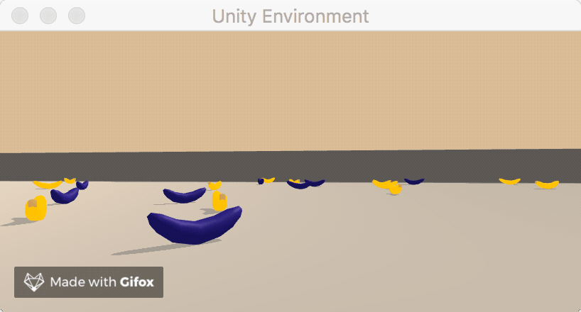

# Project: Navigation and Banana Collection. 
-----

## Description
For this project an agent was trained using a custom implementation of the deep Q learning algorithm to navigate around an open world environment. The agent was reward for collect yellow bananas and avoiding blue bananas. The implementation was then extended to include both priorities experience replay and double deep Q learning methods to compare the sample efficiencies between these methods.
The following is an example of a trained agent in the environment.




## Problem Statement
### Environment and Rewards:
The environment is an open 3D space surrounded by four solid walls that is randomly populated with blue and yellow bananas. An agent is placed in the environment and given a reward of `+1` for collecting a yellow banana, and `-1` for collecting a blue banana. The goal of the agent is to collect as many yellow bananas as possible while avoiding blue bananas. The environment is episodic and runs for `1000` timesteps after which it is reset.
### State and Action Spaces:
The agent's observation of the underlying state space has `37` dimensions and contains the agent's velocity and a ray-based perception of objects around the agent's forward direction. Given this information, the agent has to learn how to best select actions to maximise its total episodic reward. Four discrete actions are available to the agent at each timestep, corresponding to:

| Input  | Action        
| ------ | ------
| `0`    | move forward
| `1`    | move backward
| `2`    | turn left
| `3`    | turn right


### Solution:
The task is classed as solved when an agent can achieve an average score of `+13` over `100` consecutive episodes.

## Dependencies
To run this code you must run an environment with Python 3.6 kernel and the dependencies listed in `requirements.txt`. 

Running the following line will install the required dependencies:
```
pip install -r requirements.txt
``` 

Additionally you will need to download the Unity environment in which the agent was trained. Instruction for this can be found within the `DQN_navigation.ipynb` notebook or at [this link](https://github.com/udacity/deep-reinforcement-learning/tree/master/p1_navigation).

## Files
This repository contains the following files and folders: <br>
`Gifs`: A folder containing GIFs of a trained agent in action. <br>
`Graphs`: A folder containing graphs used to evaluate trained agents. <br>
`Papers`: A folder containing the papers used to implement this project <br>
`Trained_agents`: A folder containing examples agents that have solved the environment with different DQN methods. <br>
`dqn_banana_agent.py`: A file containing the implementation of the deep Q learning algorithm. <br>
`replay_buffers.py`: A file that contains the implementation of both a standard and prioritised replay buffer. <br>
`sum_tree.py`: A file containing an implementation of a sum tree for efficient prioritised sampling. <br>
`DQN_navigation.ipynb`: A notebook to train, test and evaluate models. <br>

## Running
Please open and follow the instruction in the DQN_navigation.ipynb.

## Results
Different variation of the deep Q learning algorithms were implement and used to train agents to solve the banana collection problem described above with the aim of determining which variation was the most sample efficient. 

Initially, deep Q networks (DQN) were trained using a standard experience replay and soft target update. The hyperparameters were tuned to find setting that could solve the problem in as few episodes as possible. The network architecture found to be both sample and computationally efficient was as follows:
| Layer |  Size  
|  ---- | ------
| Input (Observed State) |  37
| Hidden layer 1  | 64
| Hidden layer 2  | 64
| Hidden layer 3  | 32
| Output (Action) | 4
where each layer is fully connected and followed by a ReLU activation function.

Additionally, the agents was trained with experience batches of size 128 and the hyperparameter setting used are described in the table below:
| Hyperparameter | Value
| -----          | -----
|`replay buffer size` | 20000 steps
|`epsilon` | 0.02
|`epsilon decay rate`| 0.99995
|`minimum epsilon`| 0.02
|`gamma`| 0.95
|`tau`| 0.001
|`learning rate`| 0.0003
|`soft update frequency`| 5
Using these setting an agent was trained that could solve the problem after `458` episodes. This agent was used as a baseline to compare the training efficiency other variation of the algorithm.

Firstly, the algorithm was extended to include double deep Q learning. Using a double deep method but leaving the network architecture and all other hyperparameters the same, an agent was created that solved the problem in `356` episodes representing a `23%` increase in sample efficiency.

A prioritised experience replay (PER) buffer was then added to test how this would improve the efficiency. The parameters used for the PER buffer were as follows: 
| Hyperparameter | Value
| -----          | -----
|`alpha` | 0.7
|`initial beta` | 0.5
|`beta increment per step`| 0.0001
|`baseline priority`| 0.1
|`maximum priority`| 1
and all other agent hyperparameters were kept the same as the initial two agent.
Using only a PER buffer an agent was trained that could solve the environment in `387` episodes, which is an increase in sample effciency of `15%`.
Finally an agent was trained using both a PER and a double deep Q method and was found to solve the environment in `244` episodes which is `46%` more sample efficient that the standard implementation initially used.

The following graph shows the average score over the previous 100 episodes during the training process for each of the above agents. In this graph it can clearly be seen that both PER and double deep Q learning offer very similar improvements in training efficiency and when combined the efficiency gains were much greater.
Interestingly, this graph also shows that the PER and the double deep Q method benefit different aspects of training. By inspecting the two agents trained using the double Q method it is clear that the reduction in bias in the bootstrapping term has greatly increases the learning rate throughout training. However, in both the standard and double only cases it can be seen that the learning rate drops once the agent is achieving an average score of around 10 per an episode. With the addition of a PER buffer this drop in learning rate in the later stages of training is not observed as the biases selection of experience tuples allows for quicker refinement of an already relatively strong policy.



Although the models trained with both PER and double deep Q learning with the hyperparameters described above were able to achieve the highest efficiencies they were found to be far more unstable during the training process with far more instances of early plateauing or catastrophic forgetting. This instability during training was not observed to the same extent with the other three implementation.
By tuning the learning rate for this model it was found that these instabilities were greatly reduced and using a learning rate of 0.001 an agent was trained that could solve the problem in `208` episodes that corresponds to around a `55%` efficiency increase over the vanilla algorithm. The following graph shows a comparison of the efficiency all the agents trained.



## GIFs

Finally here are a some gifs of the final agent in action.




